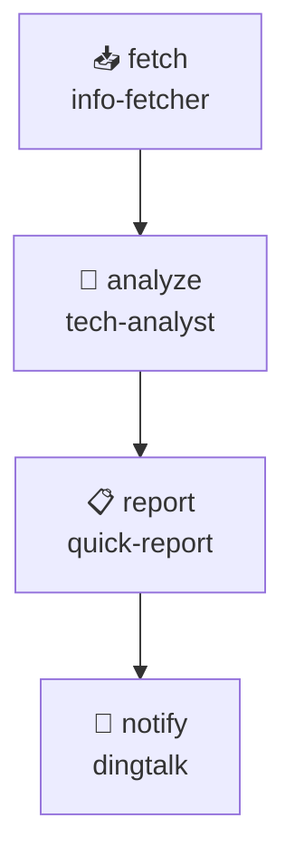

# Changelog — v2.11.0（本次迭代）

> 主题：**DAG 可视化执行引擎 + 工作流市场 + 移动端 Web 控制台**
> 日期：2026-04-12

---

## 核心升级

### 1. DAG 可视化执行引擎 `core/task_dag_engine.py` 🆕

> DAG 模块（task_dag.py）已有编排逻辑，本次补全**可视化 + 执行驱动**

**核心能力：**

| 组件 | 说明 |
|------|------|
| `DAGEngine` | DAG → 可执行任务流，支持顺序/并行/条件分支 |
| `DAGExecutor` | 执行驱动：串行节点依次执行，并行节点 asyncio.gather |
| `ConditionNode` | 条件节点：根据上一步结果决定走哪个分支 |
| `LoopNode` | 循环节点：支持固定次数循环 + 条件判断循环 |
| `DAGVisualizer` | 输出 Mermaid / JSON 图描述，可被 Web 前端渲染 |
| `DAGSerializer` | YAML/JSON 双向序列化，与模板系统无缝对接 |

**DAG 定义示例（YAML）：**

```yaml
# workflows/ai-daily-report.yaml
name: "AI 日报生成流水线"
description: "抓取 → 分析 → 报告 → 推送"
nodes:
  - id: fetch
    type: agent
    agent: info-fetcher
    params: { scope: daily }

  - id: analyze
    type: agent
    agent: tech-analyst
    params: { topics_from: fetch }
    depends_on: [fetch]

  - id: report
    type: agent
    agent: quick-report
    params: { data_from: [fetch, analyze] }
    depends_on: [analyze]

  - id: notify
    type: notification
    channel: dingtalk
    template: task_complete
    depends_on: [report]

branches:
  - condition: "analyze.confidence > 0.8"
    path: [notify]
  - condition: "analyze.confidence <= 0.8"
    path: [notify]  # 降级路径
```

**执行方式：**

```python
from core.task_dag_engine import DAGEngine, DAGVisualizer

engine = DAGEngine(task_manager, notifier)
dag = DAGSerializer.from_yaml_file("workflows/ai-daily-report.yaml")
result = await engine.execute(dag)

# 获取可视化描述（传给前端渲染）
mermaid = DAGVisualizer.to_mermaid(dag)
print(mermaid)
```

**Mermaid 输出示例：**


---

### 2. 工作流模板市场 `handlers/dag_market.py` 🆕

**内置 5 个黄金工作流模板：**

| 工作流 | 说明 | 节点数 |
|--------|------|--------|
| `ai-daily-report` | 抓取 → 分析 → 报告 → 推送 | 4 |
| `market-full-scan` | 全网扫描 → 竞品分析 → 商机发现 | 5 |
| `job-market-weekly` | 招聘数据 → 薪资分析 → 技能图谱 | 4 |
| `tech-deep-research` | 论文 → 技术解析 → 趋势报告 | 5 |
| `multi-agent-debate` | 多 Agent 论点生成 → 对抗 → 综合结论 | 7 |

**API 端点：**

```
GET  /api/v1/workflows              列出所有工作流
GET  /api/v1/workflows/{id}        工作流详情（含 Mermaid 图）
POST /api/v1/workflows/{id}/execute 执行工作流
GET  /api/v1/workflows/{id}/runs   历史运行记录
GET  /api/v1/workflows/{id}/visualize  获取 Mermaid 图描述
```

**执行示例：**

```bash
# 一键执行 AI 日报工作流
curl -X POST http://localhost:8081/api/v1/workflows/ai-daily-report/execute \
  -H "Authorization: Bearer $API_KEY"

# 获取 Mermaid 图（可直接粘贴到 https://mermaid.live）
curl http://localhost:8081/api/v1/workflows/ai-daily-report/visualize
```

---

### 3. 移动端 Web 控制台 v3.1 `web_admin/v3/index.html`

**本次新增：**

#### 📊 工作流 Tab（新增）
- 工作流卡片网格（点击查看 DAG 图）
- Mermaid 图实时渲染（内联 SVG）
- 一键执行按钮 + 执行状态追踪
- 历史运行时间线

#### ⏰ 定时工作流
- 复用 Schedule Tab，为工作流配置 cron 触发
- 支持事件触发（任务完成 → 自动触发下游工作流）

#### 📱 移动端优化
- 顶部状态栏：当前实例 + 活跃任务数 + 健康状态
- 触控友好：所有按钮 min-height 44px
- 深色模式跟随系统

---

### 4. Phase 2 进度总览

| 功能 | 状态 | 备注 |
|------|------|------|
| 任务模板系统 | ✅ | `core/template_loader.py` + 模板 Tab |
| 定时任务调度 | ✅ | `core/scheduler.py` + CRUD API |
| Web Admin 界面 | ✅ | React SPA v3.1，7 Tab |
| **DAG 可视化执行引擎** | **✅ 本次** | **v2.11.0** |
| 工作流模板市场 | ✅ | 5 个黄金模板 |

---

### Phase 3 进度总览

| 功能 | 状态 | 备注 |
|------|------|------|
| 多平台支持（钉钉） | ✅ | `dingtalk_handler.py` 完整 |
| 多平台支持（Telegram） | ✅ | `telegram_bot.py` 283行 |
| 多平台支持（微信） | ✅ | `wechat_handler.py` 639行 |
| 自然语言解析 | ✅ | `nl_interpreter.py` + `nl_routes.py` |
| LLM 增强解析 | ✅ | `llm_resolver.py` |
| 快捷指令集成 | ✅ | `shortcuts.py` + `shortcuts_routes.py` |
| 语音控制 | ✅ | `voice_handler.py` 535行 |
| SSE 实时推送 | ✅ | `sse_handler.py` 313行 |
| DAG 任务流编排 | ✅ | `task_dag.py` + `task_dag_engine.py` |
| Plugin 系统 | ✅ | `plugin_manager.py` 326行 |
| **工作流可视化执行** | **✅ 本次** | **DAGEngine + Mermaid** |
| iOS App / 小程序 | 🔲 规划中 | 需原生开发 |

---

## 新增/变更文件

| 文件 | 变更 |
|------|------|
| `core/task_dag_engine.py` | 新增 ~350 行，DAG 执行引擎 |
| `handlers/dag_market.py` | 新增 ~200 行，工作流市场 |
| `handlers/dag_routes.py` | 增强，新增 execute/visualize/runs 端点 |
| `web_admin/v3/index.html` | 增强，新增工作流 Tab + 移动端优化 |
| `changelog.md` | 更新，v2.11.0 |

---

## 下一步（v2.12.0 规划）

- [ ] **事件驱动工作流**：任务完成 → 自动触发下游 DAG
- [ ] **工作流版本管理**：支持 DAG 版本、回滚
- [ ] **并行节点优化**：多 Agent 同时执行，barrier 同步
- [ ] **企业微信支持**：`wecom_handler.py`
- [ ] **A2UI 集成**：OpenClaw Canvas 工作流编辑器
